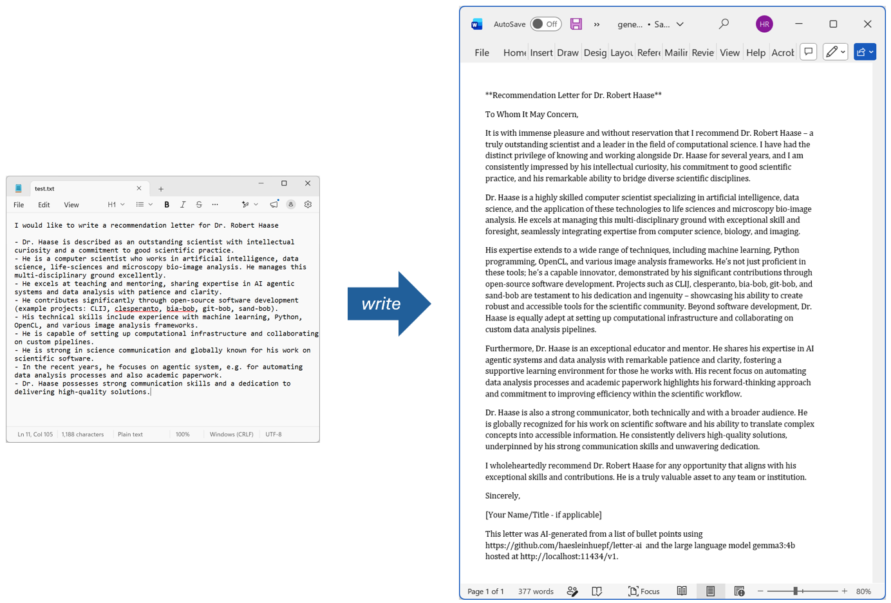
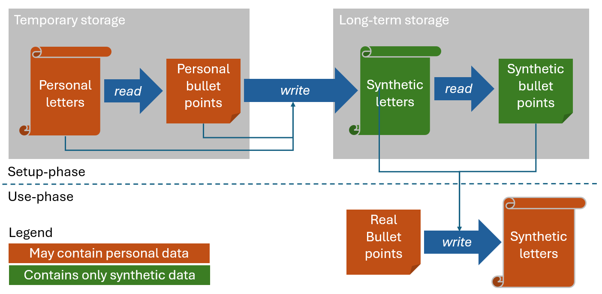

# Privacy-preserving, transparent AI-assistance for writing letters (letter-ai)

`letter-ai` is a pip-installable command-line tool for privately reading past letters and drafting new ones using a locally installed large language model (LLM). Under the hood it uses pre-existing letters and corresponding summary text files for [few-shot prompting](https://en.wikipedia.org/wiki/Prompt_engineering#Multi-shot) to make AI-generated letters sound like yours. Below you find instructions for setting up a database of synthetic letters to avoid using personal data directly for prompting and to avoid [information leakage](https://en.wikipedia.org/wiki/Information_leakage).



Note: This is a research tool not intended for production use.

## Features

- Reads and summarizes existing letters from DOCX files.
- Classifies letters such as support letters, recommendation letters, letters of intent, review reports, or other.
- Uses archived letters and their summaries as few-shot examples when generating new letters.
- Drafts a new letter from a plain-text request file containing bullet points and optionally a DOCX template.
- Stores the extracted text and summaries locally in `~/.letter-ai` and does not send anything to the internet by default.

`letter-ai` uses a local LLM by default for privacy reasons. It is recommended to use solutions such as [Ollama](https://ollama.com) with `gemma3:4b`; this keeps personal letters on your machine. It is not recommended to use remote servers for such purposes, especially if you do not know what the remote service provider does with the data you send there.

## Installation

```bash
git clone https://github.com/haesleinhuepf/letter-ai
cd letter-ai
pip install .
```

For development, use `pip install -e .`.

## Setup

### Ollama setup

Install [Ollama from its website](https://ollama.com), then open a terminal and pull a small language model:

```bash
ollama pull gemma3:4b
```

Optionally, override the model name and/or OpenAI-compatible endpoint with environment variables:

```bash
set LETTER_AI_MODEL=gemma3:4b
set LETTER_AI_BASE_URL=http://localhost:11434/v1
set LETTER_AI_API_KEY=ollama
```

On macOS/Linux, use `export` instead of `set`.

### Building a privacy-safe example database

To set up a folder of example letters that do not contain any information about real people, follow this workflow:

1. Read letters you wrote in the past with `letter-ai read old-letter.docx`. It will extract the text from the letters, categorize the letter, and summarize the content. Text and summary are saved in the folder `~/.letter-ai`.
2. Write some `request.txt` files with random content, e.g. bullet points for a recommendation letter. Draft a new letter with `letter-ai write request.txt`. Do this multiple times with multiple contents to generate a base of letters with randomish content.
3. Modify the generated DOCX to fit your needs and facts.
4. Delete the source letters containing information from actual people from the folder `~/.letter-ai` once you are done.
5. Pass the AI-generated letters using `letter-ai read old-letter.docx`.
6. Finally, go through all `.txt` files in `~/.letter-ai` and make sure that they do not contain any personal information.

Following this strategy, only the AI-generated synthetic letters and summaries are stored in `letter-ai`'s database of example letters.

Alternatively, if you do not want to use letters about real people at all, consider AI-generating letters as demonstrated in [generate_mock_letters.ipynb](docs/generate_mock_letters.ipynb).

Overall, the goal should be to have no personal data in the long-term storage `~/.letter-ai` and still be able to generate letters that use phrases of the human author.



## Usage

Write bullet points about the project or person you want to write a letter for or about in a text file, e.g. `request.txt`.

Afterwards, run this command to AI-generate a letter and open it with Word:

```bash
letter-ai write request.txt
```

You can also specify a `template.docx` file and the output location:

```bash
letter-ai write request.txt --template template.docx --output generated-letter.docx
```

Read, summarize, and archive a DOCX letter:

```bash
letter-ai read support-letter.docx
```

This extracts the document body, classifies it as a support letter, recommendation letter, letter of intent, review report, or other, writes a concise bullet summary, and stores both files in `~/.letter-ai` using names such as `supportletter1.txt` and `supportletter1_summary.txt`.

The writer uses summaries and matching archived letters as few-shot examples. A template can be supplied with `--template`; otherwise `~/.letter-ai/default-template.docx` is used when present, and then a blank DOCX is created. Each generated document includes the model, base URL, and a link to this project.

Run `letter-ai --help` or `letter-ai read --help` for all options.

## Contributing

Contributions are welcome! Consider opening an issue first before submitting a Pull Request.
Most of the code in this repository was vibe-coded using GitHub Copilot integration in Visual Studio Code. When modifying code here, consider using a similar tool.
